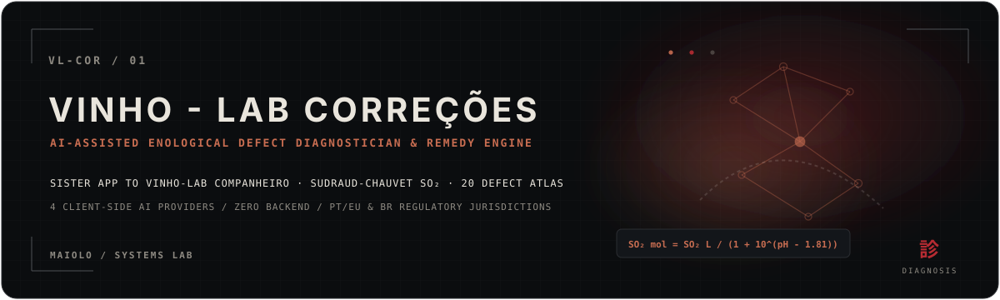
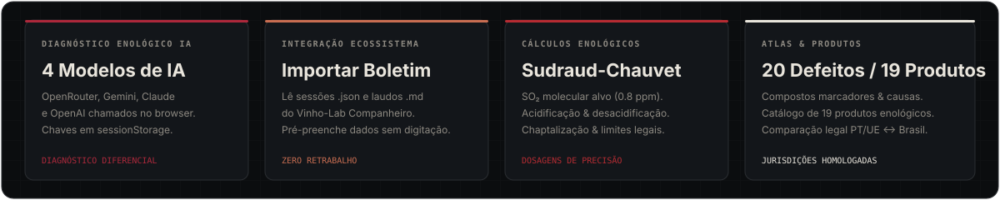
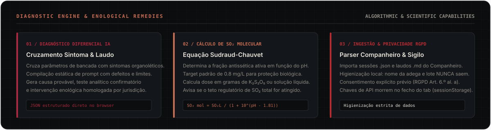
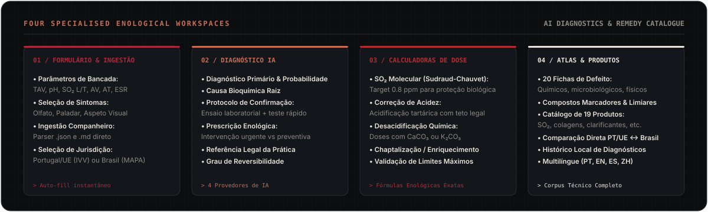
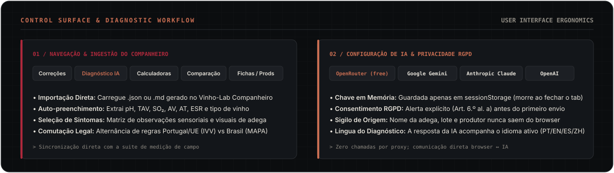
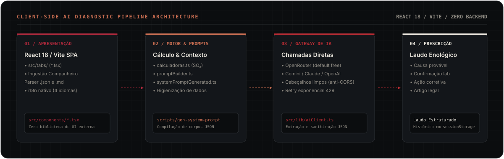
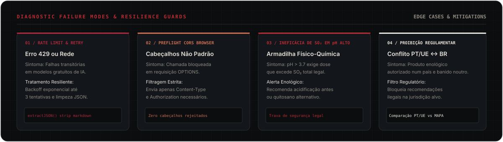
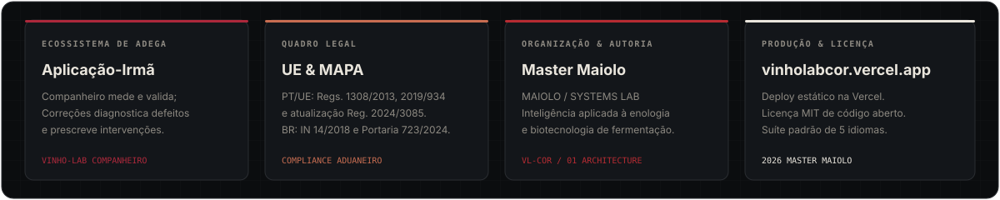

<div align="center">

# VINHO-LAB CORREÇÕES

**Diagnóstico de Defeitos do Vinho Assistido por IA e Calculadora Enológica**

[](https://github.com/mastermaiolo/vinho-lab-correcoes)
[](LICENSE)
[](https://vinholabcor.vercel.app)
[](https://vitejs.dev)
[-E9E5DC?style=flat-square&labelColor=13161A)](https://www.oiv.int)

<br/>

[English (UK)](README.md) · **Português (Brasil)** · [Português (Portugal)](README.pt-pt.md) · [Español](README.es-es.md) · [简体中文](README.zh-cn.md)

<br/>



</div>

<br/>

> **Aplicação web para enólogos, vinicultores e técnicos de adega**: diagnóstico diferencial de defeitos do vinho assistido por inteligência artificial, calculadoras de dosagens enológicas e referência legal comparativa entre **Portugal / União Europeia** e **Brasil**.
>
> Aplicação-irmã do [**Vinho-Lab Companheiro**](https://github.com/mastermaiolo/vinho-lab-comp) — *o Companheiro mede e valida na bancada e em campo; o Correções diagnostica alterações e prescreve intervenções autorizadas.*
>
> 🔗 **Aplicação em Produção:** [vinholabcor.vercel.app](https://vinholabcor.vercel.app)

> [!WARNING]
> **Ferramenta de Apoio à Decisão:** Este software foi concebido como suporte técnico na tomada de decisões enológicas. Não substitui o laudo ou boletim oficial emitido por laboratório credenciado nem dispensa o acompanhamento presencial de um responsável técnico.

---

## 01 / Índice de Navegação

- [02 / Visão Geral](#02--vis%C3%A3o-geral)
- [03 / Capacidades e Engenharia](#03--capacidades-e-engenharia)
- [04 / Espaços de Trabalho e Atlas de Defeitos](#04--espa%C3%A7os-de-trabalho-e-atlas-de-defeitos)
- [05 / Superfície de Controle e Interface](#05--superf%C3%ADcie-de-controle-e-interface)
- [06 / Provedores de IA e Protocolo de Privacidade](#06--provedores-de-ia-e-protocolo-de-privacidade)
- [07 / Calculadoras Enológicas e Matemática de Sudraud-Chauvet](#07--calculadoras-enol%C3%B3gicas-e-matem%C3%A1tica-de-sudraud-chauvet)
- [08 / Instalação e Desenvolvimento](#08--instala%C3%A7%C3%A3o-e-desenvolvimento)
- [09 / Arquitetura do Pipeline e Código-Fonte](#09--arquitetura-do-pipeline-e-c%C3%B3digo-fonte)
- [10 / Resolução de Problemas e Casos Críticos](#10--resolu%C3%A7%C3%A3o-de-problemas-e-casos-cr%C3%ADticos)
- [11 / Linhagem e Proveniência](#11--linhagem-e-proveni%C3%AAncia)

---

## 02 / Visão Geral

Quando um parâmetro físico-químico sai da conformidade ou surgem alterações sensoriais na cantina, a resposta precisa ser rápida e fundamentada. O Vinho-Lab Correções correlaciona dados de laudo laboratorial com sintomas visuais e olfativos para diagnosticar causas biológicas ou químicas, sugerir métodos analíticos confirmatórios e calcular dosagens exatas de correção.

<br/>

<div align="center">
  
</div>

<br/>

### Principais Pilares Arquiteturais

| Pilar Arquitetural | Implementação Técnica | Vantagem Prática na Adega |
|---|---|---|
| **Diagnóstico Diferencial IA** | Gateway client-side para 4 motores de IA (OpenRouter, Gemini, Claude, OpenAI) | Identifica causas, ensaios de confirmação e produtos homologados |
| **Importação do Companheiro** | Parser nativo de laudos em tabela `.md` e sessões `.json` | Zero digitação; preenchimento automático a partir das medições de campo |
| **Cálculo de $\text{SO}_2$ Sudraud-Chauvet** | Determinação do $\text{SO}_2$ molecular ativo em função do pH e temperatura | Garante proteção biológica ($0,8\text{ ppm}$) respeitando o teto legal de $\text{SO}_2$ total |
| **Atlas de 20 Defeitos** | Catálogo técnico cobrindo desvios químicos, biológicos e físicos | Compostos marcadores, sintomas de alerta e ações corretivas |
| **Zero Backend &amp; Sigilo** | Chamadas diretas do navegador à IA; chaves isoladas em `sessionStorage` | Dados de identificação do produtor e do lote nunca saem do computador |

---

## 03 / Capacidades e Engenharia

<br/>

<div align="center">
  
</div>

<br/>

### 1. Diagnóstico Diferencial de Defeitos por IA
A ferramenta recebe medições da bancada (teor alcoólico TAV, pH, $\text{SO}_2$ livre e total, acidez volátil, acidez total, extrato seco) e sintomas práticos (turvação, odor acético de vinagre, esmalte/cola, maçã oxidada, notas animais de suor de cavalo, redução).

Utilizando um prompt enológico compilado diretamente dos dados regulatórios (`scripts/gen-system-prompt.js`), o modelo de inteligência artificial retorna um JSON estruturado com:
- **Diagnóstico Primário e Probabilidade:** Identifica a alteração específica (ex.: contaminação por *Brettanomyces*, azedume acético, precipitação de bitartarato, casse proteica).
- **Causa Bioquímica Raiz:** Explica os mecanismos de deterioração do mosto ou vinho.
- **Protocolo de Confirmação:** Sugere um ensaio laboratorial oficial e um teste rápido de triagem na cantina.
- **Prescrição Corretiva Homologada:** Separa intervenções de emergência imediata de medidas preventivas de higiene.
- **Base Legal por Jurisdição:** Aponta o artigo regulamentar aplicável na União Europeia ou no Brasil.

### 2. Formação de $\text{SO}_2$ Molecular por Sudraud-Chauvet
A eficácia antisséptica do dióxido de enxofre depende exclusivamente da fração molecular livre ($\text{SO}_2\text{ mol}$), controlada pelo pH:

$$\text{SO}_2\text{ mol} = \frac{\text{SO}_2\text{ livre}}{1 + 10^{\text{pH} - 1,81}} \quad (\text{a } 20^\circ\text{C})$$

O aplicativo calcula a dosagem precisa de metabissulfito de potássio ($\text{K}_2\text{S}_2\text{O}_5$) para atingir a meta de $0,8\text{ mg/L}$ molecular. Se o pH for excessivamente alto (&ge;3,70), emite um alerta formal: elevar o sulfuroso apenas aumentará o $\text{SO}_2$ total acima do limite legal sem proteger o vinho, recomendando acidificação prévia com tartárico ou uso de quitosano fúngico.

### 3. Ingestão do Companheiro e Proteção LGPD/RGPD
Permite carregar arquivos gerados pelo **Vinho-Lab Companheiro** sem digitação manual:
- **Tabelas Markdown (`.md`):** Reconhece parâmetros e dados de prova analítica.
- **Sessões JSON (`.json`):** Lê o objeto `measurements{}` com mapeamento de unidades canônicas.

**Higienização de Dados:** Nome da vinícola, identificador do lote, data e responsável técnico são retidos localmente e jamais enviados à IA. Apenas valores numéricos puros e sintomas assinalados são despachados, mediante consentimento explícito prévio (RGPD Art. 6.º, n.º 1, al. a).

---

## 04 / Espaços de Trabalho e Atlas de Defeitos

<br/>

<div align="center">
  
</div>

<br/>

### Visão Geral das Abas do Sistema

| Aba do Sistema | Foco Operacional | Recursos e Atividades |
|---|---|---|
| **01 / Correções** | Entrada de parâmetros e ingestão de laudos | Inserção de TAV, pH, $\text{SO}_2$ livre/total, acidez volátil e total; matriz de sintomas; botão de importação do Companheiro |
| **02 / Diagnóstico IA** | Consulta e avaliação do parecer de IA | Envio para provedor selecionado; cartão estruturado de diagnóstico; grau de urgência e reversibilidade |
| **03 / Calculadoras** | Dosagens e correções de bancada | $\text{SO}_2$ molecular Sudraud-Chauvet; acidificação tartárica; desacidificação com carbonato de cálcio; chaptalização |
| **04 / Comparação** | Confronto de laudos e análise legal | Comparativo lado a lado de dois ensaios; tabela de diferenças regulatórias entre PT/UE e Brasil |
| **05 / Fichas de Defeito** | Atlas enciclopédico de defeitos | 20 fichas técnicas detalhando causas, marcadores, ensaios de confirmação e ações permitidas |
| **06 / Produtos** | Catálogo de insumos enológicos | 19 produtos enológicos comerciais em 9 categorias regulamentadas: sulfuroso, ácidos, colagens, quitosano |

<br/>

<details>
<summary><strong>Lista Completa das 20 Fichas Técnicas de Defeitos Enológicos (Clique para Expandir)</strong></summary>
<br/>

1. **Alterações Químicas (11):** Déficit de $\text{SO}_2$ Livre, Excesso de $\text{SO}_2$ Total, Acidez Volátil Elevada (Azedume Acético), pH Elevado / Baixa Acidez, $\text{CO}_2$ Residual em Excesso, Oxidação Química (Aldeído / Pardo), Formação de Acetato de Etila, Casse Cúprica, Casse Férrica, Gosto de Luz (*Goût de Lumière*), Sobre-extração Fenólica / Amargor.
2. **Desvios Microbiológicos (5):** Contaminação por *Brettanomyces* / 4-Etilfenol, Refermentação Secundária em Garrafa, Doença Láctica / Degradação de Manitol, Florescência por Leveduras de Véu (*Mycoderma vini*), Gosto a Rato (Tetrahidropiridinas).
3. **Instabilidades Físico-Químicas (3):** Precipitação Tartárica (Bitartarato de Potássio / Tartarato de Cálcio), Casse Proteica por Calor, Turvação Coloidal por Glucanos e Pectinas.
4. **Desvios Mistos (1):** Redução Química e Biológica Combinada ($\text{H}_2\text{S}$ / Mercaptanos).

</details>

---

## 05 / Superfície de Controle e Interface

<br/>

<div align="center">
  
</div>

<br/>

### Fluxo de Uso Recomendado

1. **Carregar Laudo ou Medições:** Na aba **Correções**, clique em *Importar boletim* para carregar o arquivo `.json` ou `.md` gerado no Vinho-Lab Companheiro. Selecione os sintomas observados na prova.
2. **Configurar Provedor de IA:** Clique no ícone de chave no cabeçalho para selecionar o motor desejado (OpenRouter já vem com chave gratuita pré-configurada).
3. **Solicitar Diagnóstico:** Na aba **Diagnóstico IA**, envie a consulta. Confirme o termo de consentimento de privacidade no primeiro uso.
4. **Calcular Correções:** Acesse a aba **Calculadoras** para calcular as dosagens necessárias de metabissulfito ou ácidos.
5. **Verificar Limitações Legais:** Consulte as **Fichas de Defeito** e **Produtos** para conferir a legalidade da intervenção pretendida segundo as regras do MAPA ou da União Europeia.

---

## 06 / Provedores de IA e Protocolo de Privacidade

### Motores Suportados

| Provedor | Modelo Padrão | Modalidade | Formato da Resposta |
|---|---|---|---|
| **OpenRouter** (Padrão) | `nvidia/nemotron-3-super-120b-a12b:free` | Chave gratuita pré-configurada | Parsing de JSON do system prompt |
| **Google Gemini** | `gemini-2.5-flash` | Plano gratuito / chave pessoal | Nativo `responseMimeType: application/json` |
| **Anthropic Claude** | `claude-haiku-4-5` | Chave pessoal | Parsing de JSON do system prompt |
| **OpenAI** | `gpt-4o-mini` | Chave pessoal | Nativo `response_format: json_object` |

### Diretrizes de Privacidade e Segurança

- **Chaves Voláteis em `sessionStorage`:** A chave de API inserida pelo usuário fica salva apenas na sessão temporária da aba e é apagada ao fechar o navegador.
- **Zero Armazenamento no Servidor:** O Vinho-Lab Correções opera como Single Page Application (SPA) estática. Não possui banco de dados nem armazena prompts enviados.
- **Chamadas Diretas sem Proxy:** O navegador conecta-se diretamente ao endpoint de IA selecionado, sem servidores intermediários. Cabeçalhos extras são removidos para evitar erros de CORS.
- **Atenção com Chaves Públicas:** A variável `VITE_OPENROUTER_DEFAULT_KEY` fica exposta no bundle client-side. Utilize somente chaves de teste para modelos gratuitos, sem créditos financeiros associados.

---

## 07 / Calculadoras Enológicas e Matemática de Sudraud-Chauvet

### Fórmulas Implementadas

```
1. Cálculo do SO₂ Molecular Ativo:
   SO₂ mol = SO₂ livre / (1 + 10^(pH - 1,81))

2. Dosagem de Metabissulfito de Potássio (K₂S₂O₅ rende ~50% de SO₂ ativo):
   Gramas de K₂S₂O₅ = (Delta de SO₂ Livre desejado em mg/L × Volume do Vinho em Litros) / 500

3. Acidificação com Ácido Tartárico (Teto legal: +1,5 a +2,5 g/L dependendo da zona):
   Gramas de Tartárico = Aumento desejado de Acidez Total em g/L × Volume do Vinho em Litros

4. Desacidificação Química com Carbonato de Cálcio (CaCO₃):
   Gramas de CaCO₃ = Redução de Acidez em g/L (em tartárico) × 0,667 × Volume do Vinho em Litros
```

---

## 08 / Instalação e Desenvolvimento

### Requisitos Técnicos

- **Ambiente:** Node.js 18+ ou Bun 1.1+
- **Gerenciador:** `npm` (padrão) ou `pnpm`

### Execução Local

```bash
# Clonar o repositório
git clone https://github.com/mastermaiolo/vinho-lab-correcoes.git
cd vinho-lab-correcoes

# Instalar dependências
npm install

# Iniciar servidor local
npm run dev

# Recompilar o system prompt em TypeScript a partir dos JSONs
npm run gen-prompt

# Executar testes unitários (Vitest)
npm test

# Build de produção
npm run build
```

---

## 09 / Arquitetura do Pipeline e Código-Fonte

<br/>

<div align="center">
  
</div>

<br/>

### Estrutura de Diretórios

```
vinho-lab-correcoes/
├── public/                    # Arquivos estáticos da aplicação
├── src/
│   ├── main.tsx               # Ponto de entrada montando <I18nProvider><App />
│   ├── App.tsx                # Gerenciador de abas e estado global de IA
│   ├── tabs/                  # Abas principais de trabalho
│   │   ├── Correcoes.tsx      # Formulário analítico e importação de arquivos
│   │   ├── DiagnosticoIA.tsx  # Disparo da IA e renderização do laudo de diagnóstico
│   │   ├── Calculadoras.tsx   # Fórmulas de SO₂ molecular, acidez e enriquecimento
│   │   ├── Comparacao.tsx     # Comparador de laudos e tabela de divergências legais
│   │   ├── FichasDefeito.tsx  # Fichas técnicas dos 20 defeitos catalogados
│   │   └── Produtos.tsx       # Catálogo dos 19 insumos de correção homologados
│   ├── components/            # Modais e elementos de interface
│   │   ├── Header.tsx         # Barra superior e status da API
│   │   ├── ApiKeyModal.tsx    # Modal de seleção do provedor de IA e chaves
│   │   ├── PrivacyConsentModal.tsx # Termo de consentimento prévio LGPD/RGPD
│   │   └── LanguageSwitcher.tsx # Seletor de idiomas
│   ├── lib/                   # Módulos de lógica enológica e IA
│   │   ├── aiClient.ts        # Clientes HTTP diretos para as 4 APIs de IA
│   │   ├── calculadoras.ts    # Lógica matemática das fórmulas de adega
│   │   ├── mdParser.ts        # Parsers para arquivos .md e .json do Companheiro
│   │   ├── promptBuilder.ts   # Construtor do prompt com métricas e sintomas
│   │   ├── systemPrompt.ts    # Instruções base do perfil do enólogo consultor
│   │   └── systemPromptGenerated.ts # Base técnica JSON embutida em TypeScript
│   └── data/                  # Bases de dados oficiais em formato JSON
│       ├── defeitos.json      # 20 defeitos, marcadores e protocolos de teste
│       ├── produtos_correcao.json # 19 produtos em 9 categorias autorizadas
│       ├── limites_pt_ue.json # Limites legais de Portugal e UE (Reg. 2019/934)
│       └── limites_brasil.json# Limites legais do Brasil (MAPA IN 14/2018)
├── scripts/
│   └── gen-system-prompt.js   # Script de compilação dos JSONs no system prompt
└── assets/
    └── readme/                # SVGs modulares do design system
```

---

## 10 / Resolução de Problemas e Casos Críticos

<br/>

<div align="center">
  
</div>

<br/>

### Diagnósticos e Casos de Borda

<details>
<summary><strong>1. Erro 429 de Limite de Requisições (Rate Limit)</strong></summary>
<br/>

Provedores gratuitos no OpenRouter podem sofrer sobrecarga temporária. O módulo `aiClient.ts` aplica tentativas automáticas com espera exponencial (até 3 vezes). Se a lentidão persistir, configure uma chave própria do Gemini, Claude ou OpenAI no menu de chaves.

</details>

<details>
<summary><strong>2. Falha de Preflight CORS no Navegador</strong></summary>
<br/>

Como as requisições partem do browser do usuário sem servidor proxy, cabeçalhos não homologados pelo provedor (como `X-Title` ou `Referer`) causam rejeição na requisição OPTIONS. O código sanitiza a chamada, transmitindo estritamente `Content-Type: application/json` e `Authorization`.

</details>

<details>
<summary><strong>3. Armadilha de pH Elevado com Sulfitação Excessiva</strong></summary>
<br/>

Em mostos ou vinhos com pH acima de 3,70, mais de 98% do $\text{SO}_2$ livre se dissocia e perde ação biocida. Aumentar a dose de metabissulfito ultrapassa o teto legal de $\text{SO}_2$ total sem conferir proteção biológica. O aplicativo alerta expressamente sobre esse risco e recomenda acidificação prévia ou quitosano fúngico.

</details>

<details>
<summary><strong>4. Proibições Regulatórias Cruzadas</strong></summary>
<br/>

Certas práticas ou aditivos autorizados pelo MAPA no Brasil são restritos ou vedados pelas normas da União Europeia (ou vice-versa). A base comparativa do aplicativo impede a recomendação de intervenções ilegais na jurisdição selecionada.

</details>

---

## 11 / Linhagem e Proveniência

<br/>

<div align="center">
  
</div>

<br/>

### Quadro Normativo e Jurídico

- **Portugal e União Europeia:** Instituto da Vinha e do Vinho (IVV) — *Regulamento (UE) n.º 1308/2013*, *Regulamento Delegado (UE) 2019/934* e *Regulamento (UE) 2024/3085*.
- **Brasil:** Ministério da Agricultura, Pecuária e Abastecimento (MAPA) — *Instrução Normativa IN n.º 14/2018*, *Portaria MAPA n.º 723/2024* e *Lei n.º 7.678/1988*.
- **Padrões Globais:** Organização Internacional da Vinha e do Vinho (OIV) — *Código Internacional de Práticas Enológicas*.

### Relação com o Vinho-Lab Companheiro

- **Vinho-Lab Companheiro (`vinho-lab-comp`):** Mede e valida parâmetros em bancada e atesta aptidão para exportação.
- **Vinho-Lab Correções (`vinho-lab-correcoes`):** Diagnostica falhas detectadas, calcula dosagens de intervenção e guia o enólogo nas correções permitidas por lei.
- **Autoria e Engenharia:** Master Maiolo · MAIOLO / SYSTEMS LAB.

### Licença

Distribuído sob a licença **MIT**. Consulte o arquivo [LICENSE](LICENSE) para obter os termos na íntegra.

---

<div align="center">
<sub>MAIOLO / SYSTEMS LAB · VINHO-LAB CORREÇÕES · DIAGNÓSTICO ENOLÓGICO ASSISTIDO POR IA</sub>
</div>
